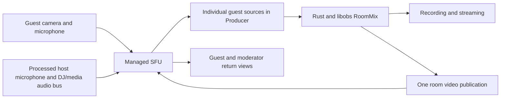

# Hosted Rooms: guest reliability and eight-feed plan

Date: 2026-09-29. Status: source audit, locally verified return-feed repair, and proposed architecture. No deployment in this checkpoint.

## Decision

Keep laptop-based peer-to-peer Rooms as the default. Repair the current return-feed lifecycle first and test eight feeds on the user's M1. Add managed TURN as a connectivity fallback. Offer SFU routing as an optional Boomin-hosted room mode or a configurable customer-provided service, retaining Producer/libobs as the compositor, mixer, recorder, and streaming engine. The SFU selector/provider integration is future work, not part of the return repair.

Recommend an SFU upgrade based on sustained measured loss, RTT, upload pressure or output frame drops, with an explanation of the cause. A decoder or compositor bottleneck on the laptop needs a quality reduction; an SFU alone does not remove that work. Switching transports requires a defined reconnect/migration lifecycle and explicit user selection.

TURN relays a connection when direct connectivity fails. An SFU forwards published tracks to multiple subscribers. TURN alone does not remove repeated return encoding or the guest audio mesh. Eight feeds are a capacity target to validate, not a verified current limit or a WebRTC protocol limit.

Cloudflare Realtime TURN and SFU fit the existing Workers/Durable Objects stack. The API also has RealtimeKit meeting infrastructure, but the Producer guest path audited here uses separate peer connections. Existing RealtimeKit setup does not establish that Producer guests already use an SFU.

## Current implementation

| Layer | Current responsibility | Consequence |
| --- | --- | --- |
| Hosted API `boomin/api/src/services/live/guests.ts` | Admission, short-lived signaling tickets, ICE configuration | Checked-in ICE defaults are STUN-only. Deployed `ICE_SERVERS` overrides remain unverified. |
| Hosted web `boomin/web/src/pages/connect/` | Guest capture, peer negotiation, playback and host render pages | Hosted room links, personal invites and open-server clients use different implementations. |
| Rust `src-tauri/src/live/graph.rs:1277` | Creates a CEF/obs-browser source for each guest, reroutes audio into libobs | WebRTC runs inside embedded browser pages; Rust does not currently terminate the guest WebRTC connection. |
| Guest render page | Receives guest media and captures host microphone plus virtual camera for return | Each main guest page captures and encodes a separate program return at a requested 640×360, 15 fps. |
| `guestMesh.ts` | Audio connections between onstage guests | Eight onstage remote guests can form 28 audio peer pairs. This is an audio mesh, not a mesh of all guest videos. |
| Rust `src-tauri/src/live/studio.rs:114` | Persistent `RoomMix` with its own OBS view/video mix | Provides a native export point independent of Studio output. Virtual camera currently reads this mix. |

Guest browser sources use canvas-sized viewports and stay alive when hidden (`shutdown=false`, `restart_when_active=false`). This preserves connections but means eight feeds still impose decode, browser, memory and compositor load even after an SFU migration. Screens and media-enabled moderators add sources. Receive-only monitors add return subscribers.

The current return audio is a browser capture of the host physical microphone, not the processed room mixer. Program audio is intentionally omitted to prevent guests hearing their own delayed voice. Consequently, the guest return cannot be assumed to include DJ/media audio or reflect Producer's microphone filters/mute.

## Confirmed source defects to repair first

Items 1–4 below are repaired in local hosted and self-hosted source. Item 5 and the wider transport issues remain follow-up work.

1. **Room return request is never started by the connection handler.** Hosted `GuestRoomPage.tsx:288` assigns `pc.onconnectionstatechange` to request `program-ready`. Line 302 assigns that same property again, replacing the requesting handler. Its only `askProgram()` calls are in the overwritten handler. This explains how virtual camera can start while the guest remains blank. It is a confirmed local source defect; the exact deployed bundle and the user's failed session have not been verified.
2. **Personal invites lack the return request.** Hosted `GuestJoinPage.tsx` has its own peer setup and does not send `program-ready`, while hosted `GuestRenderPage.tsx:378` waits for that request to attach program video.
3. **Program video depends on microphone acquisition.** The hosted render page defines `attachProgramRef` only after successful microphone capture. Denied or timed-out microphone capture can prevent video setup. Separate video readiness from host audio readiness.
4. **Early return requests can be lost.** The render page calls an optional callback on `program-ready`; a request before callback initialization is discarded. Persist the requested state, attach when prerequisites become ready, and retry until decoded frames are confirmed. `ontrack` alone is insufficient proof of visible video.
5. **Stage reconnection can leave guest audio suspended.** Both hosted and open-server `guestMesh.ts:57` reject versions less than or equal to the cached version before accepting host confirmation. The same version received from the host after a server snapshot or suspension cannot reconfirm publication. Handle equal-version authoritative confirmation without accepting stale state.

Also audit shared microphone track mutation: mesh code sets `sender.track.enabled`, which may affect other senders using the same track. Make per-destination publication decisions explicit. Queue ICE candidates until remote descriptions are set, serialize negotiation, and record failures currently swallowed by `catch` handlers.

Use generation-scoped capture ownership and cleanup. A `Promise.race` timeout does not cancel `getUserMedia`; stop any stream that resolves after cancellation or timeout. Leaving a room must release all owned tracks and automatically started return resources.

## Build sequence and release gates

### 1. Make the current path observable and correct

- Combine connection handlers; make room and invite links use the same transport lifecycle.
- Keep program-request state across initialization, reset it correctly on reconnect, and separate audio/video setup.
- Correct stage confirmation and capture cleanup.
- Share transport code between hosted web and `server/guest`, with adapters for authentication, URLs and room state.
- Record redacted room/session correlation, signaling state, selected ICE candidate type, RTT, packet loss, inbound/outbound bitrate, frames encoded/decoded, and time to first rendered frame. Never log access keys, SDP credentials or raw signaling tokens.
- Distinguish "connected to host", "waiting for room output", "receiving output" and actionable capture errors. Keep mute available throughout recovery.

Gate: both invite types show actual moving output; denying host microphone permission does not block video; host/guest leave and rejoin recover without reopening Producer.

### 2. Add managed TURN

Mint short-lived Cloudflare credentials on the backend after admission. Keep the long-term TURN key server-side. Supply returned UDP, TCP and TLS endpoints, including TLS on port 443, to every media peer path. Keep normal direct-or-relay ICE selection; force relay only for diagnostics. Set credential lifetime for the supported session duration, with refresh and ICE restart for longer sessions.

Tag usage by room/participant, bound active admissions and credential issuance, and track actual relayed bytes. Test TURN for host links, guest audio links, screens and monitors; adding it to only one constructor is incomplete.

Cloudflare documents [credential generation and supported URLs](https://developers.cloudflare.com/realtime/turn/generate-credentials/). Self-hosted deployments can retain configurable coturn, while hosted Boomin uses managed infrastructure.

Gate: connection and recovery work with forced relay and restricted UDP/TLS-only networking. This improves reachability; return lifecycle defects still require step 1.

### 3. SFU transport and one program publication

Each guest publishes camera/microphone once. Producer subscribes to separate tracks so existing scene positioning, per-guest audio controls and recordings remain possible. Initially retain CEF receivers to contain implementation scope; profile them before deciding whether native receivers are needed.

Publish the room video once to the SFU; guests and monitors subscribe to that publication. Remove per-guest virtual-camera recapture. The SFU fans out the output, reducing host return upload and encoder duplication. Normal platform streaming remains an additional output.

Replace guest-to-guest audio mesh with SFU subscriptions. Forward permitted guest microphones to other guests, excluding each listener's own track. Publish a separate host/DJ/media audio bus that excludes incoming guest audio. This provides music and processed host audio without feeding a guest their own delayed voice. Define offstage, backstage and host-listening permissions explicitly, and enforce subscription decisions in the backend.

Use the existing native `RoomMix` as the video bridge. Prototype a single shared encoder and a native WebRTC endpoint, including codec negotiation, timestamps, backpressure, resolution changes and shutdown. Confirm bundled libobs capabilities before choosing an output plugin. **Do not assume an OBS WHIP output connects directly to Cloudflare Realtime SFU:** its documented [Connection API](https://developers.cloudflare.com/realtime/sfu/api/) uses sessions, tracks and SDP; Cloudflare Stream WHIP/WHEP is a separate integration. The native endpoint must implement the selected provider's actual contract.

Keep provider sessions and track identifiers behind a Boomin transport adapter. Authenticate every publish/subscribe operation and serialize operations on each session. Preserve moderator permissions, stage controls and voting as room state above transport, so later interactive features reuse this foundation.

Gate: eight remote camera feeds, program return and recording operate together for an hour on explicitly supported host hardware. Measure CPU/GPU, memory, thermal behavior, dropped output frames and network throughput.

### 4. Capacity and cost controls

- Define separate caps for admitted people, active camera publishers, screens, moderators and viewers. Eight feeds does not necessarily mean eight guests plus unlimited screens.
- Subscribe to appropriate video layers/resolutions for onstage tiles; limit inactive feeds and default camera bitrate. Validate simulcast support in the actual browsers/provider.
- Guests receive a modest program resolution, with higher quality optional. Ordinary audience viewers should use a separately budgeted broadcast path rather than joining interactive media peers.
- Profile CEF source sizing and visibility before changing viewports or suspending pages; preserve scene geometry and audio behavior.
- Add per-room egress accounting, session duration limits and operational alerts. Set quality defaults from measured results.

## Illustrative cost, not a benchmark

Cloudflare currently lists **$0.05/GB egress**, with **1,000 GB/month free shared across SFU and TURN**. SFU ingress is free. Workers/Durable Objects and other services are billed separately. TURN-to-SFU traffic is not double charged. See [official pricing](https://developers.cloudflare.com/realtime/sfu/platform/pricing/).

Example assumes eight remote guests plus one Producer host, all guests onstage, one program subscriber per guest, no screens/moderators/audience, and constant rates:

| SFU egress | Assumed aggregate bitrate | GB/hour |
| --- | ---: | ---: |
| Eight cameras to Producer, 1.2 Mbps each | 9.6 Mbps | 4.32 |
| Program to eight guests, 0.6 Mbps each | 4.8 Mbps | 2.16 |
| Guest audio at 32 kbps, host audio at 64 kbps: seven peers plus host per guest, guest audio to Producer | 2.56 Mbps | 1.152 |
| Total | 16.96 Mbps | 7.632 |

That is about **$0.38 per full room-hour after the free allowance**, before protocol overhead and other services. At these assumptions the shared allowance covers approximately 131 room-hours across the whole account, provided no other SFU/TURN usage consumes it. Actual codec behavior, silence, retransmissions, screens, extra listeners and quality changes alter cost. TURN-only cost depends on measured relayed traffic, not total call duration alone.

## Validation matrix

Exercise one, four and eight feeds; room links and personal invites; camera and screen sharing; guest/moderator stage changes; DJ playback and host mute/filters. Use desktop Chrome and Safari, iOS Safari and Android Chrome, and supported Mac/Windows hosts.

Include direct and forced-relay connections, restricted networks, Wi-Fi/mobile switching, host/guest reconnection, microphone denial, virtual-camera absence during the interim implementation, room exit, Studio transitions and resolution changes. Verify visible decoded frames, intelligible audio with no self-return, permission enforcement, released devices and an uninterrupted recording during a 60-minute session.

This audit has not reproduced the failed production session, inspected deployed secret overrides, measured an eight-feed load, or completed the native SFU bridge. The immediate source defects are actionable now; the SFU release gate requires the prototype and measured soak results above.

## Return-feed repair checkpoint

Implemented `GuestReturnFeed` and `ProgramRequest` in `server/guest/src/guestReturnFeed.ts`, with the identical helper in hosted web `src/lib/guestReturnFeed.ts`. Both render pages use the capture owner; open-server `HostLink`, hosted room links and hosted personal invites use the request loop.

- A single hosted room connection handler now performs both state updates and return requests.
- Personal invites request program video and retain the stream when React remounts the video element.
- Video capture is registered synchronously and operates independently of microphone capture.
- Requests retry until inbound decoded-frame counts advance; an old cumulative frame count does not satisfy a new request cycle. iOS retains its five-second delay and resumes requesting on visibility changes.
- Each capture is owned and stopped on teardown, including streams that resolve after timeout or teardown. Return permission denial prevents both microphone and video capture.
- Virtual-camera appearance retries; known device labels avoid repeated physical-camera probes. Ended program tracks reuse the existing sender rather than accumulating transceivers.
- Render reconnect cleanup is idempotent and detaches close callbacks before closing resources, preventing duplicate reconnects and stale return capture.

Verified: hosted full production build, self-hosted guest typecheck/build, seven deterministic capture/lifecycle regressions (`node scripts/test-guest-return.mjs`), and actual WebKit peer-to-peer program decoding/rendering while host microphone capture is denied (`scripts/test-guest-return-browser.mjs`). The browser test uses a generated moving canvas instead of the physical Producer virtual camera and local ordered signaling instead of the deployed hub. It therefore verifies media negotiation and decoding, but not the full production path, CEF integration or eight-feed capacity.

Hosted web repair is deployed at commit `6dcd88084acb3198c20c0dfa5ed550597266feec` (successful deploy run `36645532697`, public version verified). Producer PR #97 passed frontend, server and all three Rust platform checks and was merged; the self-hosted repair and rebuilt assets are published in the repository.

Managed TURN provisioning succeeded in API run `36646591107`. Real Chromium peers exchanged and decoded moving video in both directions with relay-only ICE, first using the normal TURN URLs and then using only TLS port 443. The verified key was stored as production Worker secrets without writing credentials to files or logs. API commit `bb01da62a3c2b372925ecf4b8b85efe72a41a247` issues short-lived participant credentials after admission and preserves explicit customer ICE overrides. Production deploy run `36646825866` passed. Credentials have a 24-hour lifetime; automatic renewal for longer calls is not implemented.

The user confirmed real program return picture in Windows Chrome from Tauri dev. Host audio and a phone return have not yet been confirmed. Mesh/stage corrections, optional SFU mode and an M1 eight-feed soak remain unverified or unimplemented. The automated relay test does not exercise Producer's virtual camera or CEF receivers.

Scene binding follow-up is implemented locally in Tauri dev: occupied slot capture preserves authored visibility, size and position; cleanup releases occupancy from the admitted roster rather than an engine snapshot; recreated guest items can recover their saved placement; source rows and eyes represent the occupant. The real test exposed a second delayed-removal bug: the roster publisher used engine visibility while stage handling used bindings, and a host's broadcast arriving before its HTTP response was mistaken for a mod request. Logs confirmed repeated stage show/hide requests. The publisher now uses the same binding truth as the handler, and outstanding host publications are recognized before the response assigns their version. Nineteen slot/stage regressions and the full frontend production build pass. This follow-up is not yet in a signed desktop release, and the live scene-switch retest remains pending. Previously saved disabled slots require staging the guest once to re-enable their authored look; intentionally hidden slots are not silently rewritten.

### Physical guest release check

1. Reopen the Producer room to load the deployed embedded guest page. Join its guest link from another device, preferably on cellular, and admit the guest.
2. Verify the guest sees moving room output and hears the host microphone. Verify Producer receives the guest camera and microphone. Use headphones and check there is no delayed self-return.
3. Deny the host render page's microphone permission where possible and verify program video still returns. Switch the guest between Wi-Fi and cellular and verify recovery.
4. Leave the room and confirm camera/microphone indicators turn off. Rejoin and verify return recovers without restarting Producer.

### M1 capacity check (pending)

Test one, four, then eight distinct remote camera publishers with program return enabled. Use a 720p30 output, recording and a real stream together, and run the eight-feed case for 60 minutes. Record the M1 model/RAM, network upload, native CPU and render FPS, skipped output frames, destination dropped frames, reconnects, memory and thermal behavior. Review the saved recording for continuous picture/audio and check each guest's decoded return. Synthetic browser peers are useful for transport checks but do not alone establish the native Producer capacity result. No eight-feed capacity claim is approved by the tests completed so far.
