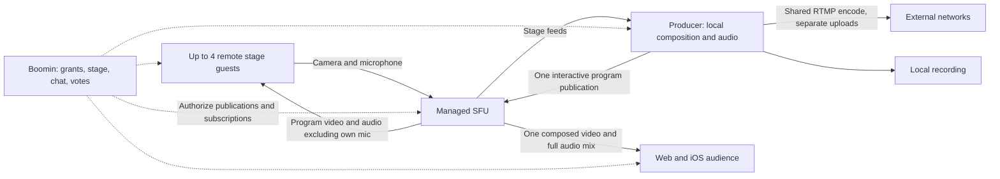

# Producer + Boomin: hardware production, interactive rooms, and cost

Reviewed October 2, 2026. Target: up to 100 connected people per room, with a small camera stage and external networks distributing the larger show.

Implementation checkpoint: [Hardware-first interactive rooms pilot](INTERACTIVE-ROOMS-PILOT.md). The review below records the original findings and longer-term relay design; the pilot uses existing infrastructure and bounded direct media, without adopting another Cloudflare product.

## Recommendation

Keep composition, audio processing, recording, and encoding on the Producer machine. Publish the interactive program once to a managed selective forwarding unit (SFU), which forwards compressed media to viewers. Send the higher-quality show directly from Producer to external networks when host upload permits it. Keep room identity, admission, stage control, chat, and interactions in Boomin.

This makes host media work depend primarily on camera feeds and output profiles. Viewer growth increases relay bandwidth, rather than adding encoders and peer connections to the host. It does not eliminate delivery bandwidth or the host's dependence on a healthy computer and connection.

Start with 100 total people, including the host and moderators; four remote camera publishers plus the host's local camera; and receive-only audience members. A screen share consumes an additional media budget. An eight-feed production mode should follow a measured hardware soak, rather than being implied by a 100-person audience limit.

Cloudflare Realtime SFU is the first transport candidate because of its published egress rate and our existing Cloudflare control/TURN infrastructure. Compare a working native publication against LiveKit's native SDK before committing. Engineering time and mobile reliability matter alongside bandwidth price. Do not buy cloud GPUs for the initial forwarding workload.

## Scope and evidence

Inspected Producer's Rust/libobs engine, encoders, multistreaming, recording, studio and DJ audio, browser guest sources, peer signaling, guest returns, monitors, interactions, and iOS profile entry points. Inspected Boomin's room schema, admission, grants, realtime hub, TURN, RealtimeKit integration, stream lifecycle, and hosted web audience/guest pages.

For the current API, used `.codex-work/boomin-api-live-status` and fetched `origin/main` at `09fe6d76f3abc545874347821f40b5ad07f44dc4`. The older `/Users/klevelandbishop/Documents/boomin/api` checkout is behind this work. The web checkout is at `6dcd88084acb3198c20c0dfa5ed550597266feec`. Producer and iOS contain ongoing local changes; this review describes the inspected files, not a clean release tag.

This is a source review with current provider documentation. It is not a 100-person load test, a hardware benchmark, or a confirmation of current production billing. No application code or production configuration was changed for this review.

## What is already useful

| Existing component | What it gives us | Evidence |
| --- | --- | --- |
| Native libobs engine | Local graphics/audio lifecycle, GPU conversion, hardware encoder selection, frame/render statistics | [engine.rs](../src-tauri/src/live/engine.rs), [encoders.rs](../src-tauri/src/live/encoders.rs) |
| RTMP multistream | One shared H.264/AAC encode for several compatible destinations | [multi.rs](../src-tauri/src/live/multi.rs) |
| Independent local recording | Recording quality can differ from stream quality; it uses another encoder | [record.rs](../src-tauri/src/live/record.rs) |
| Persistent room composition | A clean room video source independent of the surrounding Studio output | [studio.rs](../src-tauri/src/live/studio.rs), `RoomMix::video` |
| Guest framing and audio strips | Individual guest sources can be composed and controlled locally | [graph.rs](../src-tauri/src/live/graph.rs) |
| Native DJ audio | Local deck playback and audio feeding the production mix | [dj.rs](../src-tauri/src/live/dj.rs) |
| Room grants and stage state | Host/moderator/participant roles, media/input capabilities, default guest cap 8 and stage cap 4 | [schema.ts](../.codex-work/boomin-api-live-status/src/db/schema.ts), [room-access.ts](../.codex-work/boomin-api-live-status/src/services/live/room-access.ts) |
| Hibernating WebSocket hub | Room/control fanout and server-timed votes without continuously running a media VM | [hub.ts](../.codex-work/boomin-api-live-status/src/realtime/hub.ts) |
| Managed TURN | Existing fallback for networks that block direct WebRTC connectivity | [guest-ice.ts](../.codex-work/boomin-api-live-status/src/services/live/guest-ice.ts) |
| Producer presence reporting | Distinguishes an open studio from actual active RTMP output, with expiring leases | [presence.rs](../src-tauri/src/live/presence.rs) |

The RTMP encoder is shared, but uploads are repeated per destination. Recording, an interactive output, and a platform output can require separate encode sessions. Current hardware encoder selection does not prove that browser WebRTC returns use hardware encoding.

## The current paths are different

**Native Producer guests:** guest camera/microphone arrives through peer connections; OBS creates browser sources for guests. Program returns capture the virtual camera separately for each receiver. Guest-to-guest conversation uses an audio mesh. TURN is already present; it relays a peer connection when necessary, but does not replace this topology with shared fanout.

Evidence: [hostLink.ts](../server/guest/src/hostLink.ts), [GuestRenderPage.tsx](../server/guest/src/GuestRenderPage.tsx), [guestReturnFeed.ts](../server/guest/src/guestReturnFeed.ts), [guestMesh.ts](../server/guest/src/guestMesh.ts), [monitorFeed.ts](../src/lib/monitorFeed.ts).

**Web studio:** uses Cloudflare RealtimeKit meetings. Its broadcast path starts a cloud composite/export that feeds Cloudflare Stream. This can serve a useful browser-hosted product, but adds cloud production services the desktop already supplies. It should be an explicit alternative mode, rather than an invisible dependency of native Producer rooms.

Evidence: [LiveRoomHost.tsx](/Users/klevelandbishop/Documents/boomin/web/src/components/live/LiveRoomHost.tsx), [realtimekit.ts](../.codex-work/boomin-api-live-status/src/services/live/realtimekit.ts), [live.ts](../.codex-work/boomin-api-live-status/src/routes/app/live.ts).

**Audience:** the self-hosted audience door is a room/voting experience without video. The hosted audience page is a single poll with a two-second refresh. These are separate contracts. The iOS brand profile links out to a live URL; there is no native room media player in the inspected iOS source.

Evidence: [AudiencePage.tsx](../server/guest/src/AudiencePage.tsx), [AudienceVotePage.tsx](/Users/klevelandbishop/Documents/boomin/web/src/pages/AudienceVotePage.tsx), [BrandPublicProfileView.swift](../boomin-ios/Sources/BrandPublicProfileView.swift).

## Proposed media and control layout

The diagram represents the target. The native SFU publication and audience playback are not implemented today.

### Audio must have two explicit destinations

Audience members receive the full processed program mix: host, music/DJ, media, and on-stage guests.

Stage guests receive a processed host/music/media bus that excludes incoming guest microphones, plus the other allowed guest microphone tracks from the SFU. Each guest excludes their own track. Stage guests must not also play the full program mix, which would duplicate guest voices and return their own voice with delay. The host monitors guests once through the production audio path.

This requires a real native audio bus and an explicit gain/mute policy. Producer's existing return code captures a physical microphone separately (`guestReturnFeed.ts`, `attachAudio`), so the host's production mute, processing, or DJ content is not guaranteed to match what guests hear. Routing this audio is a correctness requirement, not just a bandwidth optimization. Test headphones, speaker echo cancellation, music, ducking, mute, and sample-clock synchronization.

### Define what the audience watches

Choose the clean room composition by default, with an explicit option for a composed whole-Studio program where appropriate. Never accidentally publish production controls. The persistent `RoomMix` is a useful native input, but it is not an encoded WebRTC publisher.

Retain a higher-quality profile for external platforms and local recording. Use a modest interactive profile first, then evaluate a second quality layer. An SFU cannot create several quality layers from a single encoded source without extra encoding somewhere. Codec compatibility, keyframe requests, encoder bitrate feedback, and A/V timestamps belong in the publisher contract.

## Missing work, ordered by impact

### 1. One native interactive publisher

Add a transport bridge from Producer's selected native video/audio outputs to one SFU publication. Support hardware-encoded H.264 and an interactive audio codec such as Opus. Current RTMP AAC cannot simply be treated as the SFU audio track.

The shipped engine presets disable OBS WebRTC (`ENABLE_WEBRTC: false` in [producer-presets.json](../engine/producer-presets.json)). The old WHIP plan in `LIVE-REVIEW.md` is a plan, not working code. Also, Cloudflare Realtime SFU uses its session/track Connection API; Cloudflare Stream's WHIP/WHEP interface is a different product. Enabling an OBS WHIP output does not by itself integrate the low-level SFU.

Cloudflare's API requires server-held credentials, authorized session/track creation, and serialized SDP mutations per session. A successful API response is not evidence that subscribers decode frames. Use an application publication generation, retain returned session IDs, and reconcile retries/cleanup. [Connection API](https://developers.cloudflare.com/realtime/sfu/api/).

LiveKit is a credible alternative for the spike: its Rust SDK documents publishing pre-encoded frames, including hardware encoder output, without another transcode. It still requires proper frame boundaries, timestamps, keyframes, rate feedback, and subscriber-compatible codecs. This integration has not been tested in Producer. [Pre-encoded publication](https://docs.livekit.io/transport/media/pre-encoded/).

A single browser/virtual-camera publisher can prove fanout quickly, but it must be measured before making hardware or latency claims. The preferred production boundary is a native bridge that avoids requiring a virtual-camera extension just to go live inside Boomin.

### 2. Atomic admission and authoritative media permissions

Separate room occupancy, camera publisher capacity, stage capacity, and backstage preview budgets. The current `guestCapacity` is not a total audience limit.

In [guests.ts](../.codex-work/boomin-api-live-status/src/services/live/guests.ts), join paths count accepted guests before a later write; `acceptGuest` and `admitGuest` transition to accepted without that capacity check. Concurrent joins can race, and different admission paths can bypass the check. Use atomic reservations with expiry, applied to all applicable paths; make retries idempotent and reconnects resume the same participant.

`setStage` reads `stageVersion`, increments it, then updates without comparing the old version. Competing controllers can collide or overwrite. Use a room coordinator or database compare-and-swap, plus a host ownership epoch to reject commands from an old host session. A room Durable Object is a natural coordinator; database records retain durable history.

The backend must mediate every SFU publish/subscribe request against room grants. Do not give clients provider secrets or unrestricted track lookup. Demotion, removal, grant expiry, and room closure must revoke relevant media access, not just hide UI. The current direct mesh relies on receiver-side enforcement; an SFU path gives us a server-controlled enforcement point.

#### Moderator scene changes: an existing DO relay needs a stronger command protocol

A follow-up trace found that Boomin scene changes already reach Producer through the room Durable Object. In [live-contributions.ts](../.codex-work/boomin-api-live-status/src/routes/app/live-contributions.ts), the moderator's HTTP request checks access, reads the scene directory, updates Postgres, and then publishes `scene.cut` through the DO. Publication errors are logged, but the route still returns success. The DO is currently a relay on this path, rather than the authoritative command coordinator.

Producer receives the frame immediately through [roomControl.ts](../src/lib/roomControl.ts) and [Live.tsx](../src/views/Live.tsx). The 20-second scene-directory refresh is a recovery path, not the normal scene-cut delivery mechanism. The moderator UI marks a scene active after the API response; there is no correlated acknowledgment from the production engine proving that the scene reached the output.

Strengthen the existing room DO: validate current capabilities, durably assign command IDs and sequence numbers, forward promptly to the current host session, and distinguish accepted, applied, failed, and expired commands. Replicate durable history to Postgres outside the immediate delivery path. On reconnect, synchronize current state and expire old momentary cuts instead of replaying them blindly. Account for permission revocation on sockets that outlive their opening ticket.

Keep scene execution local. `applyScene` issues multiple UI-to-engine transform/audio calls and implements fade/move transitions through browser animation callbacks. A native batched scene operation and native transition scheduler can improve application consistency and avoid dependence on an active UI animation loop. A DO cannot render the host's scene. Measure command submission, DO acceptance, host receipt, native application/transition completion, and monitor display separately before attributing the user's reported delay to any one component. The normal configured transition can also intentionally take time; an immediate cut should be an explicit operation.

### 3. A shared audience room protocol and real iOS room screen

Use one stable room link with participant identity, visibility checks, expiring access, snapshot plus ordered deltas, and reconnect recovery. Share its event schema across web, iOS, and desktop.

Add composed video/audio, presence, room chat, question/hand queue, reactions, moderation, and votes. Join as a viewer without requesting microphone/camera; request those when a person accepts a stage invitation. Handle iOS audio interruptions, app backgrounding, orientation, and returning from authorization without duplicating subscriptions.

Existing brand DM chat remains a brand conversation; room chat needs its own membership and lifecycle. The interaction vocabulary is broader than its implementation: only `vote` is currently enabled in [interactions.ts](../.codex-work/boomin-api-live-status/src/services/live/interactions.ts).

Replace steady audience polling with hibernating WebSocket fanout. At 100 clients, a two-second poll is approximately 50 requests/second or 180,000 requests/hour before retries. Coalesce transient reactions and roster updates; persist important commands/results, rather than every animation or media statistic.

### 4. Stage transport and host resource budgets

Move guest audio from the mesh into selective SFU subscriptions, and migrate guest camera transport to the same room authority. A bounded four-guest P2P stage can be a temporary migration step while audience fanout is added; it is not the final architecture.

OBS currently creates persistent browser sources at canvas-sized viewports per guest/screen. Their connections stay alive when hidden. Keep a strict feed budget and subscribe only to required stage or deliberately selected preview feeds. Profile memory, decode, and render costs; native guest receivers can follow if measured browser overhead justifies them. Do not rebuild the entire renderer before proving the audience path.

The mesh also deserves a reconnect fix: `suspend` clears confirmation, but `applyStage` rejects the same version even if it is now a host confirmation. That can leave a reconnecting guest unable to publish until a newer stage update. Audit shared microphone track mutation across senders as part of migration.

### 5. Lifecycle, telemetry, and graceful degradation

Add separate evidence for studio open, interactive output ready, and external output on air. Current presence is based on active RTMP destinations; it cannot advertise an interactive-only room when no destination exists. Confirm readiness with actual received/decoded media and fresh publication identity.

Retain existing engine frame statistics, destination congestion/drop metrics, and guest quality reports. Add sampled per-room first-frame time, received/decoded FPS, freezes, loss, RTT, jitter, relay use, bytes, encoder choice, CPU/GPU pressure, and stage promotion latency. Aggregate rather than writing each sample independently to the main database. Reconcile traffic estimates with provider usage.

Managed TURN exists with 24-hour credentials; test renewal for long sessions. SFU tracks have inactivity/lifecycle limits, so resume must republish when the old transport is gone. Handle ICE restart, stale callbacks, sleeping hosts, audience churn, and a kicked client trying to reconnect. [Cloudflare SFU limits](https://developers.cloudflare.com/realtime/sfu/platform/limits/).

Start with one conservative interactive video layer and an audio-only fallback. A weak viewer connection should degrade that viewer without forcing every external platform stream to its bitrate. Independent queues and bounded buffering must keep the interactive publisher from blocking the production engine.

## Cost model

These are planning estimates, not measured invoices. Cloudflare publishes SFU/TURN egress at $0.05 per GB, with a shared account allowance of 1,000 GB/month. SFU ingress is free; application services are separate. The calculations below use the paid rate before that allowance. [SFU pricing](https://developers.cloudflare.com/realtime/sfu/platform/pricing/).

Example full room for one hour: one host, four remote stage guests, 95 viewers. All 99 remote participants receive composed video. Stage guest cameras are 1.2 Mbps each, delivered once to Producer; microphones are 32 kbps each. Viewers receive 96 kbps mixed audio. Each stage guest receives a 64 kbps host/media bus plus the other three microphones. Producer receives the four guest microphones.

This gives `aggregate egress Mbps = 99 × program video Mbps + 14.688`. Decimal GB/hour is `aggregate Mbps × 0.45`.

| Interactive program video | Estimated relay GB/hour | Estimated media cost/hour |
| --- | ---: | ---: |
| 0.8 Mbps | 42.25 | $2.11 |
| 1.2 Mbps | 60.07 | $3.00 |
| 2.0 Mbps | 95.71 | $4.79 |

Excluded: protocol overhead/retransmissions, extra screens/backstage subscriptions, cloud recordings, app/API/database/control services, taxes, and negotiated discounts. Bitrates are assumptions, not quality guarantees. Use average occupancy and subscribed minutes, not peak room capacity, for forecasts. The free allowance is shared across the account and should not be the business model.

For comparison, 100 RealtimeKit audio/video participants for one hour are $12 in participant charges; an export adds $0.60/hour at the published rates. Its managed SDKs may save engineering time. [RealtimeKit pricing](https://developers.cloudflare.com/realtime/realtimekit/pricing/).

Stream delivery for 99 viewers watching one hour is $5.94 at its published $1/1,000 delivered minutes, before other components such as stage transport. WebRTC delivery billing begins October 15, 2026; it is not yet charged on this review date. RTMP/SRT recordings consume storage and cloud restream outputs count toward delivery. At higher video bitrates, per-minute delivery can beat per-GB delivery. Compare actual quality and feature needs. [Stream pricing](https://developers.cloudflare.com/stream/pricing/).

Host upload also constrains quality. The current 4.5 Mbps video plus 160 kbps audio RTMP profile uses about 14 Mbps for three destinations, despite sharing the encode. A 1.2 Mbps interactive publication with the assumed audio buses adds roughly 1.36 Mbps before overhead. Directly sending that program separately to 99 people would require roughly 128 Mbps before platform uploads. The SFU avoids that host fanout.

At 100 simultaneous rooms using the 0.8 Mbps example, provider aggregate egress is roughly 9.4 Gbps. That is infrastructure scale, while each host still produces a small stage. Viewer count alone does not prove that any host can sustain four guest decodes, recording, multiple outputs, and the selected resolution.

## Build sequence and release gates

1. **Prove one native publication:** Producer output to web and iOS through the candidate SFU. Verify hardware encoding, processed audio, first frame, feedback/keyframe behavior, and cancellation. Compare Cloudflare integration effort with the LiveKit native path.
2. **Make room authority consistent:** atomic occupancy/publisher reservations, stage versions/host epochs, grants, authorized track catalog, provider cleanup, and interactive-only presence.
3. **Ship viewer mode:** stable shared room link, video/audio, room chat, votes/reactions, hand queue, reconnects, and moderation on iOS/web.
4. **Complete the stage path:** selective guest subscriptions, correct audio excluding self, four-camera budget, controlled backstage previews, and host/device adaptation.
5. **Measure before raising caps:** 20, 50, then 100 participants, and a 60-minute minimum-device soak with four guests, recording, and multiple external destinations. Expand the camera budget only after passing.

Required checks include UDP-blocked/TURN/TLS fallback; mobile interruptions; simultaneous joins at capacity; stale-host stage commands; kicked participants losing media; host crash/sleep; repeated promote/demote; mic mute and DJ audio; no doubled/self audio; and a slow receiver not stalling the production engine. Synthetic viewers verify fanout, but real phones and guest devices are needed for actual encode/decode and interaction behavior.

Initial performance goals to measure, not current claims: p95 audience glass-to-glass latency below one second on supported networks, stage conversational audio below 350 ms, bounded first-frame time, stable decode/render rates, and no sustained loss of production FPS on the minimum supported host. Revise targets based on the spike and regional measurements.

## Later: deals, owned VMs, and GPUs

First collect room hours, participant-minutes, GB delivered, average bitrates, concurrent peaks, regional latency, and support burden. Those are the inputs for provider discounts and self-hosting economics.

An SFU primarily forwards compressed tracks: capacity depends on CPU, packet handling, encryption, and network, without requiring a GPU for composition. Use GPUs when remote composition, transcoding, extra quality layers, visual processing, or cloud production/failover are justified. [LiveKit SFU architecture](https://docs.livekit.io/reference/internals/livekit-sfu/).

If owning the relay becomes economical, LiveKit is an available self-hosting path. Its documented distributed model places a room on one node and scales across rooms with coordination and graceful draining. Budget regional capacity, TURN, redundant nodes, idle headroom, operational work, and bandwidth rather than comparing only VM rental. [Distributed deployment](https://docs.livekit.io/transport/self-hosting/distributed/).

Keep Boomin room IDs, grants, stage policy, and interactions independent of the provider. Define a narrow media adapter for publication, subscriptions, feedback, and cleanup. Switching a provider still entails codec, SDK, transport, and reliability testing; an interface alone does not make migration free.

The host machine remains the production failure boundary in this first build. If it sleeps or disappears, its composed show stops. A continuous cloud show requires a separate backup publisher or remote producer and is a later product tier.

For an experience comparable in feel to Whatnot, prioritize fast join, readable room activity, responsive reactions, reliable audio, smooth stage invitations, moderation, and recovery. Auctions or purchases require a server-owned clock, ordering, inventory, and idempotent payment commands. Client hardware should produce media and animations; it should not decide authoritative winners or payments. This review makes no claim about Whatnot's internal infrastructure.
