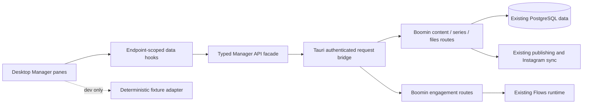

# Web Producer → Desktop Manager

Status: implementation proposal, not an implementation or deployment.
Reviewed September 25, 2026. Owner intent: Manager first, then hosted Automations; implement with Sol after this review.

## 1. Decision and scope

Port the existing Boomin publishing/CMS experience into a locally bundled desktop Manager. Keep Boomin's existing hosted data, publishing services, social synchronization, attribution and automation runtime. Most domain functionality already exists. The work is predominantly UI adaptation, data integration and validation, with several specific backend/transport gaps described below. It is not a database migration, a new CMS backend, or a complete copy of the Boomin application.

The user-approved navigation is:

1. Clicking **Manager** in Producer's main rail opens the publishing overview shown in the latest overview screenshot.
2. A **collapsible collections siderail is always present** inside Manager, including on the overview. Its collapse state persists across views and app restarts.
3. The inner rail's existing **Manager** item becomes **Stages**, opening Drafts, In Review, Scheduled, Failed and Collab Invites.
4. Collections expand to units; selected units expand to their `unit_parts`. Unit and part selections change the main pane while retaining the rail.
5. Unit detail matches the supplied content-preview/detail reference, retaining account/publication information and Automation attachment.
6. Remove Studio entry points and revenue/metrics presentation. **Preserve revenue attribution and its underlying associations and services.**

The screenshot's light content panels, typography, spacing, tab treatment and hierarchy are the visual reference. Desktop's surrounding app rail, window controls and workspace switcher remain native to Producer. A second Boomin app header, credit balance, assistant or account shell is not part of the port.

Manager supplies the inventory and publication identity for the future free ManyChat alternative. Storage remains the intended paid component; this work introduces no per-contact or per-run product charge.

### Scope boundaries

| Include | Keep behind the scenes | Exclude from this implementation |
| --- | --- | --- |
| Publishing overview, releases, upcoming and published history | Existing social synchronization and attribution | Studio sessions, generation canvases, credit purchase gates |
| Persistent collections → units → parts rail | Existing folders and access-control relationships | Neon → D1 migration |
| Stages and existing review/scheduling/publishing operations | Existing publish jobs, distributions and integrations | New newsletter, X or Threads authoring systems |
| Unit preview, caption, channels, files, comments and part UI | Existing part/take/entity relationships | Full Automations editor/runtime migration |
| Real-post detail and attaching an existing automation | Existing web/admin surfaces | Public production rollout during the initial UI review |
| CLI-friendly identifiers and API boundaries | Existing desktop quick-post and self-hosted support | A replacement financial or attribution system |

Existing optional tabs such as Contestants, sharing and crew are not implicitly deleted from Boomin. Carry them only where their existing API and product context are supported; they are not prerequisites for the comment-to-DM launch. Do not render dead buttons as apparent functionality.

## 2. Evidence and source map

Inspected local revisions (not a claim that each equals the latest deployed server):

| Checkout | Commit | Location |
| --- | --- | --- |
| Desktop Producer | `cf55688` | `Documents/producer` |
| Boomin web | `13d1312` | `Documents/boomin/web` |
| Boomin API | `07991fe` | `Documents/boomin/api` |
| SDK/CLI | `ebe3ee2` | `Documents/boomin/sdk` |

Before implementation, record working-tree status and check for upstream changes without discarding local work. Reconcile changed source components rather than assuming these observations stay current.

### Source components and port treatment

Paths below are relative to the corresponding checkout's `src/` directory.

| Source | What it actually does | Desktop treatment |
| --- | --- | --- |
| web `components/content/PublishingTimeline.tsx` | Exact overview body: today's releases, ideas, upcoming/history, Home/Series/Monitor; also renders metrics and requests generated ideas | Extract the operational overview; remove metrics, revenue and automatic generation requests |
| web `pages/producer/ProducerHomePage.tsx` | Hosts timeline, derives headline, loads series and includes multiple Studio/home variants | Reuse only the headline/data orchestration needed for the screenshot; do not copy the whole page |
| web `pages/content/index.tsx` | Routes collection/unit selection, mounts rail, loads parts, switches into prompt sheet | Replace web routing/auth/assistant coupling with a persistent desktop Manager shell |
| web `pages/content/ContentSidebar.tsx` | Collapse controls, collections, expanded units and clips | Reuse hierarchy and visuals; label Stages; retain expand control at narrow widths |
| web `pages/content/ManagerView.tsx` | Drafts/review/scheduled/failed/collab queues | Port as `ManagerStages`; preserve existing API behavior |
| web `pages/content/CollectionDetail.tsx` | Collection units plus Studio, insights, crew and contest dependencies | Extract collection inventory and relevant existing actions |
| web `pages/content/UnitDetail.tsx` | Large combined draft/published editor, preview, publishing, files, flows, Studio and insights | Split into smaller desktop detail sections, reusing behavior rather than copying the monolith |
| web `pages/content/MediaPreview.tsx`, `UnitList.tsx`, `ContentThumbnail.tsx`, `ChannelAccordion.tsx` | Preview/carousel/thumbnails/channel settings; preview also imports media editing/upload state | Port selected rendering and settings; inject desktop file transport |
| web `pages/producer/PromptSheetSurface.tsx` | Part selection and prompt editing, but also rendering, generation, entities, takes and sheet interchange | Extract non-generation part presentation/editing, preserving IDs and documents |
| web `hooks/useContentData.ts` | React Query caches and mutations | Adapt to endpoint-scoped keys and injected transport |
| web `pages/content/types.ts` | API aliases, stage mapping, filters and display types | Preserve mappings deliberately; do not reuse its global filtering everywhere |
| web `index.css` | Light-mode screenshot-specific overrides | Translate the relevant design rules into scoped Manager styles |
| desktop `views/Home.tsx` | Main surface rail, workspace, rooms, quick post, jobs and settings | Mount Manager here; avoid expanding this already-large file with the new CMS |
| desktop `lib/ipc.ts`, `src-tauri/src/ipc.rs`, `src-tauri/src/client.rs` | Existing authenticated root API bridge, keychain credentials and brand scope | Reuse for JSON requests; add typed Manager facade and structured errors |

### Backend capabilities already present

- `routes/app/content.ts` and `services/content.ts`: collections, units, distributions, folders, social posts, assignment, overview, comments and attribution.
- `services/content-publish.ts`: actual publishing and publish-status orchestration. A CMS edit must not bypass it by directly marking an item published.
- `routes/app/series.ts`: despite the series/episode/shot route vocabulary, it reads/writes **content_collections, content_units and unit_parts**. `loadSeries` accepts a non-archived collection without requiring `kind='series'`.
- `services/series/serialize.ts`: part DTOs include kind, spec, prompt document, source/media URLs, status, entities and takes.
- `services/instagram-sync.ts`: media discovery and upsert keyed by integration plus Instagram media ID already populate social-post inventory.
- `routes/app/files.ts`: folder-aware upload URL/finalization, listing and reordering already exist.
- `routes/app/engagement.ts`: existing Flows and post-trigger endpoints.
- `services/route-context.ts`: authenticated brand resolution, surface grants and folder scope. Desktop must retain these checks.

## 3. Navigation and visual specification

```text
Producer main rail
  Rooms
  Manager  ── opens Overview
    [persistent, collapsible Manager siderail]
      Overview / Manager heading → Overview
      Stages [count]
      Collections
        Collection
          Unit [stage]
            01 Part [status]
            02 Part [status]
      + New collection
  Automations  [later milestone]
```

Use the siderail header/Overview control as the way back to the overview. Do not retain an “Exit Manager” action that navigates to a separate sidebar-free web Producer home. Moving back to Rooms belongs to Producer's outer rail.

Suggested route state is a small discriminated union owned above the panes:

```ts
type ManagerLocation =
  | { view: 'overview' }
  | { view: 'stages'; tab: 'drafts' | 'review' | 'scheduled' | 'failed' | 'collabs' }
  | { view: 'collection'; collectionId: string }
  | { view: 'unit'; unitId: string; collectionId?: string; returnTo?: ManagerReturn }
  | { view: 'part'; unitId: string; partId: string; collectionId?: string; returnTo?: ManagerReturn }
  | { view: 'post'; socialPostId: string; returnTo?: ManagerReturn };
```

`ManagerReturn` must be a bounded parent location, not a recursively growing history blob. Keep internal Back behavior and originating Stages tab. First click on the outer Manager button opens Overview as requested. Persist rail collapse independently; retain expansion/scroll while navigating inside the workspace. Reset resource selection when changing workspace. A memory router is optional; a whole-app React Router conversion is unnecessary.

### Overview

Retain the screenshot's date/headline, today's releases, upcoming schedule, published history and useful actions. Reflow the table after removing Views/Comments, Leads, Revenue, statistics tiles and the 24h/7d/30d metrics selector. Keep Post, publication timing, Platforms and Status. Status/counts needed for navigation are operational information, not the removed performance dashboard.

The original Home/Series/Monitor control needs deliberate treatment:

- Home: the operational publishing timeline.
- Series: reuse collection inventory rather than the existing `SeriesImpactPanel` analytics. Use “Collections” if the view includes non-series collections.
- Monitor: retain comments/reply monitoring if ported; it is not a revenue panel. Fetch lazily, only while open.

Keep the ideas layout initially with existing static fallback suggestions; the current component calls `generate('ideas.suggest')` on mount/cache expiry. Do not import that call or the Producer credit gate into a free operational page. Headline should be derived from existing scheduled/draft state and should not require an LLM.

Pagination must work beyond the first page: web home currently requests 50 posts; the overview API supports page/per_page. “Today” counts derived from one page can be incomplete—either use honest loaded-item counts or a proper complete summary, never label partial counts as global totals. Upcoming currently caps at 20; expose that limit or extend pagination if the UI claims to show the full schedule.

### Stages and collections

Keep the five supplied Stages tabs. Preserve `schedule` → `scheduled` mapping. Include partially failed units in a deliberate failure/recovery treatment rather than letting them disappear between tabs. Processing items remain visible through publication status even though the reference has no Processing tab.

The web `inManagerScope` excludes social imports and Studio-stage units. That predicate is suitable for selected workflow queues, **not the whole content inventory**. Imports must remain in Overview and post detail. Existing Studio-stage units remain discoverable inside collections/parts with a neutral “In production” label; removing Studio navigation does not delete or silently promote their data.

### Unit and part detail

Keep the reference metadata bar: parent/breadcrumb, content type, connected publications, Automation, stage. Remove Enter Studio and Insights/revenue display. Keep content preview, caption, existing transcript display, comments and applicable publishing actions. Do not add automatic transcription/generation jobs when simply opening a unit.

Parts are real records, not the carousel preview's slide indexes. A unit's distribution-folder images and its `unit_parts` may differ. Both ordered lists must remain accurate; do not synthesize parts from attachments or assume clicking carousel slide 3 selects part 3.

Part pane: ordered part strip/tree selection, kind-aware label (shot/segment/slide), media or source preview, state/error, authored text/spec information and existing take history. Preserve `prompt_doc` mention spans/entity references; a plain textarea that drops mentions is not a safe replacement editor. Extract the existing document editing primitives or keep complex documents read-only until the faithful editor is ready. Port existing non-generation create/update/reorder/delete operations as explicit actions, with appropriate permissions and confirmations for destructive changes. Rendering buttons, model pickers, credit spend and Studio sessions are outside scope.

Existing selected-take changes and media edits may affect compilation; investigate their side effects before enabling them in desktop. Viewing all takes is safe to implement first. Sheet interchange can be reused once tested; it is not necessary to invent another export format.

## 4. Integration architecture



### Locally bundled UI, existing hosted APIs

Do not iframe the website or repurpose the runtime-delivered settings Console for Manager. Manager is a core desktop/open-product surface, should participate in desktop navigation, and should not inherit Boomin's entire authentication/Studio shell.

Create `src/features/manager/` with:

```text
ManagerShell.tsx       ManagerOverview.tsx     ManagerStages.tsx
ManagerSidebar.tsx     CollectionView.tsx      UnitView.tsx
PartView.tsx           PostView.tsx            AutomationAttachment.tsx
components/            api.ts                  contracts.ts
queries.ts             navigation.ts           manager.css
fixtures.ts            ManagerPreview.tsx
```

Start with this feature directory, not a new multi-repository UI package. Record source provenance in the ported files. Extract a shared package later only if maintaining both implementations justifies it. Do not copy private configuration, tokens or the web application's bootstrap into the public desktop tree.

Recommended small dependency additions: React Query for server state and Lucide for matching icons. Desktop already uses React 19. Use scoped CSS under a Manager root, taking values from the web light-mode rules; do not import all of web `index.css` or global Tailwind preflight. The web uses Tailwind, Router, Zustand, Sonner and many unrelated dependencies; these are not an all-or-nothing requirement. Prefer callbacks/context and Producer's existing notices where adequate.

### Reuse the authenticated bridge

`guests.request` in desktop `lib/ipc.ts` already invokes `endpoint_request`, which resolves endpoint/keychain credentials and calls `ProducerClient::access_request`. Paths such as `/v1/app/content/overview` and `/v1/app/series/...` can use that mechanism. It appends the endpoint's brandSlug. No browser-held bearer token, second sign-in or new reverse proxy is needed for normal JSON reads/writes.

Expose a neutral endpoint-request helper rather than making Manager import a symbol named guests forever. Existing access callers must keep working.

A real transport gap: `access_request` maps **every 404** to `available:false` and drops structured error status/code on other failures. Manager must distinguish missing resource, unsupported backend, permission denial and expired auth. Add a backwards-compatible structured variant or opt-in envelope retaining status/code/message/body. Do not infer “self-hosting unsupported” from a deleted unit's 404. Do not overwrite all errors with an empty successful list.

Use explicit endpointId in every request; let Rust attach brand scope. Never pass a user-selected brandSlug from arbitrary query strings. Encode IDs/query parameters. Avoid global mutable “current API client” state that can change mid-save.

### Cache and workspace isolation

Adapt query keys to `[manager, endpointId, resource, ...ids/filters]`. Web's keys such as `[content, units]` do not include a workspace and are unsafe to copy unchanged into a multi-endpoint desktop.

On workspace switch: flush or resolve pending saves against their captured original endpoint; discard/cancel stale responses; clear selection and per-workspace cached sensitive state as appropriate. Do not let the active workspace at completion determine where a save goes. Scope invitations, flows, file previews and parts just as carefully as units.

Load rail collections once, collection units on expansion, parts for the active unit, comments/flows only when their pane opens. The existing global units list is unpaginated; it can bootstrap current usage but should not force every unit, thumbnail and part to load merely to draw the siderail. Avoid duplicating the old Manager job polling while the new overview is active.

### Self-hosted compatibility

The present open `server/schema.sql` does not implement this CMS's collections/units/parts. This is a hosted-first release. Independent endpoints keep their working posting/rundown experience until the shared backend work ships. Gate the new CMS by known supported endpoint/capability; do not silently redirect independent data to Boomin or show a populated-looking fixture library.

## 5. API inventory and identified gaps

All routes below are existing Boomin app routes unless marked proposed; prefix with `/v1/app`. This is a port inventory, not a promise that every route is already fully tested in desktop.

| Capability | Existing route or service | Desktop work / gap |
| --- | --- | --- |
| Overview | GET `/content/overview?page=…&per_page=…` | Map timeline/upcoming/pagination; hide metrics; don't use jobs as post inventory |
| Collections | GET/POST `/content/collections`; GET/PATCH/DELETE `/content/collections/:id` | New/list/rename/archive; preserve admin gates; archive is not hard delete |
| Units | GET/POST `/content/units`; GET/PATCH `/content/units/:id` | Collection/stage filters, selected detail, autosave and folder materialization |
| Files/folders | `/folders/list`, `/files/list`, `/files/reorder` | Resolve distribution/resources/footage folders; preserve media ordering |
| Upload | POST `/files/upload-url`, PUT signed URL, POST `/files/finalize` | Folder-aware desktop upload adapter; existing generic media upload is not automatically equivalent |
| Publish/review | `/content/units/:id/publish`, `/publish-status`, `/approve`, `/reject`, `/revise` | Reuse service transitions; show errors and per-channel outcomes |
| Distributions | `/content/units/:id/distributions`, `/content/distributions/:id` | Preserve IDs, schedule and channel-specific settings |
| Social inventory | GET `/content/social-posts`, `/content/social-posts/:id`, `/content/units/social-posts` | Standalone post pane for records lacking unit_id |
| Assign existing post | POST `/content/social-posts/:id/assign-unit` | Explicit user action; add retry-safe assignment and validate target ownership before reuse |
| Synchronization | `routes/app/integrations.ts`, `services/instagram-sync.ts` | Reuse manual sync/status; don't invent a scraper or call mock import for discovery |
| Parts | GET `/series/:collectionId/episodes/:unitId/shots` | Includes all part kinds and take/entity/media DTOs; use real IDs/order |
| Part mutations | `/series/:collectionId/episodes/:unitId/parts`, `/shots/:partId`, `/shots/reorder` | Reuse validation; align per-unit folder access; support collection-less units if needed |
| Comments | GET `/content/unit/comments`, `/content/post/comments`; existing reply API | Lazy loading; preserve distinction between public comment and private DM action |
| Collab invites | Existing SDK/web list/respond/auto-accept methods | Port exact integration endpoints and authorization, not local-only toggles |
| Automation attachment | GET `/flows/triggers/by-post`, POST `/flows/triggers/create`, existing flow list | Keep flow IDs; label Automations; target integration + media ID |

### Backend work that is genuinely needed or conditional

**A. Unit/part authorization parity — required before broad release.** Content detail uses folder-role assertions; inspected series part reads verify brand/collection/unit but do not pass the equivalent unit folder gate. Part writes rely on broad editor standing. Extract shared guarded part services or add equivalent checks before exposing these paths to folder-scoped collaborators. A hidden UI control is not authorization. Test unauthorized collection/unit/part combinations.

**B. Standalone post detail — required UI addition.** Instagram discovery creates posts without a unit. Web home opens such posts externally. Desktop must show their metadata, account, comments and automation attachment directly. Opening a post must not create a unit. “Add to collection” can explicitly invoke assignment. The current assignment helper creates a new unit whenever no unit_id is supplied, even if the post already has one; concurrent/retried assignment needs an existing-link check and atomic/idempotent handling before that action ships. Validate target collection belongs to the same brand.

**C. Collection-less parts — conditional small API addition.** Part records require a unit but not a collection; current routes require a collection path. For existing collection-less units with parts, prefer a guarded `/content/units/:unitId/parts` facade backed by the same serializers/services. Do not create fake collections to satisfy a UI path. Start with existing routes for collection-owned units; no general API rewrite is required.

**D. Folder-aware upload — required for draft editing parity.** Use existing presign/finalize semantics. Stream files through Rust for native paths if needed, or upload browser-selected File objects to presigned URLs after JSON authorization through IPC. Validate dev/Tauri origin CORS. Do not base64 large media through generic JSON IPC, and do not forward the Boomin bearer token to storage URLs. Keep progress/cancel/retry/finalize behavior explicit.

**E. Structured errors — required small transport change.** Preserve HTTP error information without changing access-surface behavior accidentally.

**F. Query cost and missing fields — optimize only after measurement.** Overview currently computes attribution and metrics even when not rendered. Optional `include_metrics=false` / `include_attribution=false` projections can avoid unused reads while preserving default behavior for web/admin. Hiding metrics never removes attribution writes or schema. Avoid a second aggregate endpoint until actual fan-out or payload size warrants it.

`GET /content/units/:id` currently materializes folders. Read-only data-review tools must not assume that GET is side-effect-free; use fixtures for initial visual work and a disposable test workspace for integration checks.

## 6. Preserve publishing, parts and attribution semantics

There are two existing post creation paths:

- Desktop quick-post submits a Producer intent/job, and the hosted adapter creates/uses CMS data.
- Web Manager edits an existing content unit and publishes its distributions through content services.

Keep quick-post working, but edits to an existing CMS unit must use the second path. Calling `submitPost` when the user means “publish this unit” can create a different unit and break identity/attribution. Refresh Overview after either path and resolve the resulting unit/post.

The web autosave sends stage/type/caption and the complete selected distributions array. Omitted or stale channels can therefore overwrite distribution choices. Port with deliberate pending-save handling, endpoint capture, ordered mutations and visible save failure. Flush the latest save before publish/schedule. Never use draft autosave to mutate already-published provider content unless an explicit supported edit path exists.

Preserve:

```text
collection → unit → part(s)
                 → distribution → published social post
                                   ↳ integration + provider media ID
                                   ↳ comments / flow triggers
                                   ↳ attributed deliveries / orders
```

Do not rename database tables to match desktop labels. Do not rewrite post IDs when importing UI state. The Instagram identity is the account/integration plus media ID; unit ID and part ID are not substitutes. One unit can have multiple publications, so automation attachment must choose an actual eligible publication rather than the first arbitrary result. Scheduled content has no guaranteed published media ID; show a pending/unavailable attachment state until a supported binding exists.

Existing content types are media-focused, despite a few UI branches recognizing Text. Collections should stay format-neutral, and labels should recognize part kinds. Adding text/newsletter authoring requires schema/API/publisher work later; it is not secretly included in this UI port.

## 7. Automation boundary for this milestone

Manager should ship with an attachment panel for existing flows and clear publication identity. The current web UnitDetail already lists flows and creates `instagram.comment.created` triggers using integration_id plus a media-ID/text condition tree. Preserve this exact payload contract through typed helpers and a contract test; do not replace it with an assumed new rules format.

Before enabling a live attachment action, prove the runtime consumes the rules emitted by the UI and avoids duplicate attachment on repeated submission. Keep API names `flows`; desktop calls them Automations. “Create automation” must navigate to a working editor or remain unavailable until the subsequent Automations milestone. It must not create an empty flow and strand the user on the old `/agents?tab=flows` web route.

The later Automations milestone retains the earlier full-Flows-parity goal and agent CLI requirement. This proposal's Manager completion is not equivalent to the ManyChat launch: that additionally requires a real comment-to-DM test, eligibility/opt-out checks, failure visibility and CLI parity.

For CLI readiness, expose stable collection/unit/part/post/integration IDs in typed contracts and selectable exports. SDK currently has declarative apply precedents; no new database-only agent pathway should be created. Reuse the same authorized service contracts for CLI work later.

## 8. Implementation work packages for Sol

Work sequentially with a small diff and a written checkpoint per package. No parallel agents are required. Do not fold DB migration, Studio, or all of Flows into one task.

| Package | Deliverable and main files | Completion evidence |
| --- | --- | --- |
| M0 — contract/fixture foundation | `features/manager/contracts.ts`, `navigation.ts`, `fixtures.ts`, typed `api.ts`; source/API mapping | Fixtures cover all navigation states and distinguish post/unit/part identities; no real writes |
| M1 — dev visual port | ManagerShell/Sidebar/Overview/Stages/Collection/Unit/Part/Post panes; scoped CSS; guarded preview entry in `App.tsx` | Screenshot comparison at native desktop sizes, real navigation and collapse; no Studio/metrics |
| M2 — hosted reads | IPC facade, endpoint-scoped query hooks, mount in Home, existing API reads | Collections, parts and social history agree with the test workspace; permission/errors explicit; workspace switching safe |
| M3 — CMS actions | Draft edits, collections, folder uploads, part CRUD/reorder, review/schedule/publish/collabs; targeted API fixes | Mutations survive navigation/reload, preserve IDs and attribution; no duplicate posts |
| M4 — automation attachment and comments | Existing-flow selector, eligible publication selection, comments/reply UI and freshness | Trigger payload matches runtime; standalone/imported post works; duplicate submit protected |
| M5 — integration/release readiness | Focused regression tests, API permissions tests, documented dev demo and rollback | End-to-end criteria below; existing rooms/settings/posting remain functional |

M1 intentionally comes before live writes so the user can judge the exact design cheaply. M0/M1 should not require Rust engine rebuilds or a public release. The expensive areas are extracting UnitDetail/PromptSheet dependencies and validating writes/media/auth, not drawing the rail. No reliable hour estimate is possible without implementing the first slice; use these completion gates rather than a speculative percentage or deadline.

### Dev workflow

The browser path in `App.tsx` currently enters onboarding when there is no Tauri bridge. Add a **dev-only**, explicit Manager preview route/query behind `import.meta.env.DEV`, rendering the fixture adapter directly. Production must never show fixtures because auth/network fails. Show a clear preview marker in development.

Use Vite/browser iteration for layout, then native Tauri for IPC, file selection, media playback, keyboard/window behavior and workspace integration. `scripts/dev.sh` performs a bundled native build for CEF/live testing and is unnecessary on every CSS edit. Native smoke checks remain necessary before release; browser screenshots are not proof that macOS uploads or videos work.

Use the normal desktop build scripts/lockfile. Add a focused frontend test command if required; current root package has build but no frontend test script. The open server already has a Vitest job; do not move unrelated UI tests into the server just to reuse it.

### Proposed verification

- UI: overview first; siderail across every pane; collapsed control always reachable; Stages tab/return context; collection/unit/part selection; no blank pane for orphan posts.
- Sizes: 1280×800 default and 960×600 minimum, plus the supplied wide screenshot layout. Preview and detail columns scroll correctly; title-bar dragging does not swallow controls; keyboard focus and tooltips remain usable.
- Data: collection with no units; unit with zero parts; shot/segment/slide; carousel files differing from parts; deleted unit; archived collection; unknown future type; many-page post history.
- Multi-workspace: switch while reads/uploads/autosaves are in flight; identical query paths in two endpoints; no old-workspace flash or cross-workspace mutation.
- Permissions: owner/editor/viewer/folder-scoped member; inaccessible parts and media; absent content or Flows grants; independent endpoint with no CMS.
- Publishing: queued/scheduled/processing/published/partial/failed; caption save before schedule; account reconnect; multi-account unit; repeated publish request behavior.
- Attribution: reuse the API's existing `content-revenue.test.ts`; compare stable identity links and attributed totals around nonfinancial Manager edits in fixtures/test workspace. No new revenue UI.
- Parts: reuse `services/series/shot-ops.test.ts` reorder invariants; preserve authored documents, mentions, takes and source files on edits.
- Automation: real imported Instagram post identity; flow selection; trigger rules; no attachment to synthetic `mock_media_*` IDs; no duplicate trigger after retry; separate later real DM release test.
- Existing desktop: Rooms, Live entry, Settings/Console, quick-post, independent endpoints and update flow continue to work.

Run frontend build for frontend changes; targeted API tests/typecheck for API changes; Rust check/format for transport changes. The repo's CI also checks the open server and Rust across platforms. Do not claim checks passed until run; this document-only review did not execute product tests or live sends.

## 9. Release boundary and rollback

Use a dedicated Manager preview/rollout flag; do not overload unrelated guests/mods/network flags. First demo fixtures, then hosted test workspace, then native integration. Preserve the existing independent Manager path. A flag can return hosted users to the previous rundown without deleting new CMS state because the underlying records and APIs are shared.

Any backend fixes should be additive/backwards-compatible and deployed before enabling dependent desktop actions. This proposal does not authorize an automatic new production release; the current request is research and planning. No DB schema migration is expected for the initial hosted UI, except if a demonstrated gap later requires one and is documented separately.

## 10. Remaining decisions and bounded defaults

These should not block the initial dev preview:

- **Part editor extent:** default to faithful non-generation viewing/editing and existing CRUD; render/model/credit workflows stay out. Complex prompt editing is not “done” if mentions are lost.
- **Monitor:** comments are useful for Automations, so retain an operational comments view; SeriesImpact analytics are excluded. Realtime can follow the existing ticket/subscription contract, or initial foreground-only refresh can be explicitly labeled. Do not import web auth-token storage for realtime.
- **Sharing/crew/contestants:** preserve data and add only supported existing controls; confirm optional UI scope during the visual review rather than rebuilding their whole product areas.
- **Media editing:** plain upload/preview/reorder/removal is core; the existing browser MediaEditor is not automatically part of removing Studio. Inventory it before any editing controls are included.
- **Styling:** follow the light Manager reference inside desktop chrome; do not redesign dark/live surfaces as part of this work.

## 11. Source references for implementation

- [Web publishing overview](../../boomin/web/src/components/content/PublishingTimeline.tsx)
- [Web home host](../../boomin/web/src/pages/producer/ProducerHomePage.tsx)
- [Web Manager shell and part selection](../../boomin/web/src/pages/content/index.tsx)
- [Siderail](../../boomin/web/src/pages/content/ContentSidebar.tsx)
- [Stages](../../boomin/web/src/pages/content/ManagerView.tsx)
- [Unit detail](../../boomin/web/src/pages/content/UnitDetail.tsx)
- [Part sheet](../../boomin/web/src/pages/producer/PromptSheetSurface.tsx)
- [Content hooks](../../boomin/web/src/hooks/useContentData.ts)
- [API client inventory](../../boomin/web/src/lib/api.ts)
- [Content routes](../../boomin/api/src/routes/app/content.ts)
- [Content services](../../boomin/api/src/services/content.ts)
- [Parts routes](../../boomin/api/src/routes/app/series.ts)
- [Parts serializers](../../boomin/api/src/services/series/serialize.ts)
- [Instagram discovery](../../boomin/api/src/services/instagram-sync.ts)
- [Folder-aware file routes](../../boomin/api/src/routes/app/files.ts)
- [Desktop mount point](../src/views/Home.tsx)
- [Desktop request bridge](../src-tauri/src/client.rs)
- [Earlier Automations/backend direction](AUTOMATIONS-ARCHITECTURE.md)

Research limitations: static source inspection and the earlier read-only Neon schema assessment. No new live database queries, browser session, production writes, uploads, generation calls, provider sends, code implementation or deployment were performed for this proposal. Runtime claims require the integration checks above.
