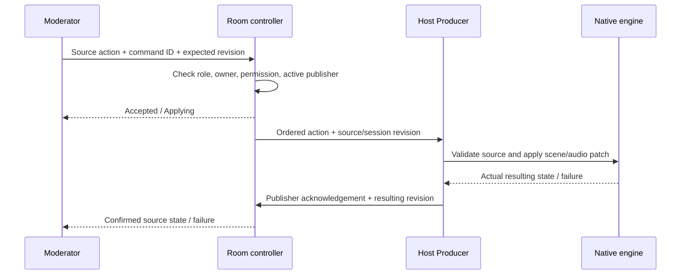

# Moderator experience review

Reviewed October 3, 2026 against the host and Windows moderator screenshots, current Producer implementation, Boomin API, public room bundle, self-hosted server and native audience entry. Extended with the architecture audit requested after the initial UI review. This is a proposed redesign; no runtime behavior or deployed UI was changed for this review.

## Architecture conclusion

Keep the hardware-first architecture. The host's native engine already supports independent transforms, visibility and audio, and applies validated scene cuts under the OBS scene lock. The room Durable Object already orders scene commands and acknowledges the current publisher's results. The shared program capture supplies one virtual-camera capture and two processed audio buses to the audience and return peers. These are the right foundations.

The missing integration is a room-owned source catalog and source-specific commands with actual host confirmation. Existing moderator camera/screen contributions have their own special placement path, separate from normal scene membership. The current staging and audio paths also need correction before a simpler interface can accurately describe them. No new Cloudflare product or media provider is required for these changes. Peer encoding and host upload still grow with video viewers; the current hard limit is eight direct video viewers, separate from the 100-person interaction limit.

## What was traced

| Layer | Current behavior | Implication |
| --- | --- | --- |
| Moderator UI | `ModBoard.tsx`, `modBoard.ts`, `ModSeat.tsx` | Permission, capture and placement controls are mixed; camera and screen share participant-level placement state. |
| Host composition | `Live.tsx`, `modFeed.ts`, `participants.ts` | Mod sources are created from roster grants, placed outside guest slots and exempted from normal scene membership. |
| Control authority | `roomControl.ts`; API `realtime/room-commands.ts`, `hub.ts` | One publisher, ordered cuts, idempotent command IDs, expiry and host acknowledgements exist for scenes. Source operations are not covered yet. |
| Room mutations | API `realtime/room-mutations.ts`, `services/live/guests.ts` | Admission/stage operations are serialized, but stage requests and confirmed output still share one list. |
| Access | API `room-access.ts`, `monitor.ts`, `participant-grants.ts`, live access/contribution routes | Room control and permission to contribute media are separate. Media grants to monitor seats are host-only. |
| Transport | `seatMedia.ts`, `monitorFeed.ts`, `hostLink.ts`, `guestMesh.ts` and web counterparts | Dedicated program return exists; audio mesh coverage and mute propagation are inconsistent across entry paths. |
| Native engine | `live/graph.rs`, `engine.rs`, `program_audio.rs` | Host composition stays local; remote inputs are monitored to the host and excluded from the stage return audio bus. |
| Entry and lifecycle | Web Pages room function / `room-main.tsx`; iOS `RoomAudienceView.swift` | Branded links must preserve the internal transparent renderer. Native iOS audience playback is receive-only; stage participation currently opens the web guest invitation. |

Producer `Live.tsx` and `seatMedia.ts` match the release clone inspected. The inspected native graph differs in formatting, without a behavioral difference in the audited functions. The API and web inspections used the current release-work clones under `.codex-work`, rather than the older neighboring checkouts.

## Findings that affect the redesign

### 1. Repair the internal renderer first

`/connect/guest/render/:id` also matches the new Pages route `/:brand/guest/:roomSlug/:code`. The Pages handler serves the dedicated room entry bundle, which lacks an explicit renderer route. That bundle interprets the URL as a branded invitation for brand `connect`, room `render`, code `<id>`. The resulting invitation-error page is captured as the moderator's browser source and becomes part of the program.

This explains the screenshot; it is not evidence that the moderator's actual invitation expired. Restore the explicit transparent renderer route in the bundle Pages really serves, and regression-test both domains, query parameters and the branded public entry routes. This fix remains pending because the user stopped editing before requesting this audit.

### 2. Mute does not reach every microphone sender

`GuestMesh.connect()` clones the local microphone for each peer. `GuestRoomPage.toggleMute()` disables only the original track. `GuestMesh.applyDirection()` enables its clone according to stage membership without checking the original microphone's mute state. The same pattern exists in the Boomin web implementation.

An isolated reproduction against the actual mesh class confirms that muting the original track leaves the peer clone enabled, including after a later stage update. This is a functional privacy defect, not a labeling issue. One microphone policy must drive all outbound tracks: local mute, host mute, permission and confirmed speaking eligibility. A reconnect or stage update must not re-enable a muted clone. Stopping the mesh must only stop its owned clones, not the capture shared with the host leg.

The reproduction uses lightweight peer/track doubles, not a physical audio call. Its independent clone state follows the [W3C Media Capture and Streams specification](https://www.w3.org/TR/mediacapture-streams/#dom-mediastreamtrack-enabled): enabled/disabled is a property of each track object. This supports the code finding; the fix still needs real browser audio verification.

### 3. Multi-person return audio is incomplete

Native bus 0 contains the audience mix. Bus 1 excludes all remote guest/mod microphones, rather than excluding only the recipient's voice. `Live.tsx` selects bus 1 for guests and media-capable moderator seats. That design depends on a separate guest audio mesh for hearing other participants.

`GuestRoomPage` establishes that mesh, but `SeatMediaLeg` and the direct `GuestJoinPage` do not. A moderator can hear the host and local program media while missing other remote speakers. Existing one-phone confirmations establish host↔guest audio, not a complete host + moderator + guest conversation.

Reuse the existing room signaling and mesh where appropriate, with the mute correction above. Keep program sound and other-participant voices from being played twice. Verify owner mute, host mute, cue, stage removal and reconnect in all supported entry paths. Native iOS audience playback does not itself solve guest speaking or speaker echo cancellation.

### 4. Media grant transitions can leave the wrong return sender

The host caches `MonitorSender` by participant ID and skips an existing sender. A read-only monitor receives peer `main`, audio bus 0. When the host grants media, the same participant becomes a sending seat and needs peer `program`, audio bus 1. The moderator replaces its receiving leg, but the host's reconciliation does not replace the existing sender when that configuration changes.

Reconcile by participant plus transport configuration/generation, not participant ID alone. Replace and close the obsolete sender before starting the replacement; retain the shared program capture lease correctly. Test adding and revoking each media grant while the seat remains connected. This can otherwise leave the return missing or attached to the wrong peer/audio bus.

### 5. Stage requests are not command-correlated proof

The API lets room controllers post the full stage list. `setStage()` persists it, advances its revision and updates presence clocks/contributions. The moderator reducer treats any revision newer than its request as confirmed host truth—even a second moderator's request. The optional API `expected_version` is not exposed by Producer's current `setStage` IPC. Serialization alone therefore does not prevent a stale full-list write from overwriting another intent.

The audit reproduced a second writer clearing the first moderator's pending state without a host acknowledgement. The self-hosted bearer-link `ModSeat` also updates its stage UI optimistically before confirmation. Boomin `setStage()` refreshes host presence for every caller, so a moderator request can refresh a host-online signal without proving that the active host is connected. The self-hosted mod path explicitly avoids stamping host presence.

Use explicit request IDs, source revisions and the active publisher's applied state. Separate requested state from confirmed output; clocks and contribution records should follow the appropriate confirmed lifecycle, not an unconfirmed placement request. Preserve guest admission/slot binding separately from visual visibility and speaking eligibility. Camera, screen and microphone need their own state; a participant being staged does not prove a particular track is visible.

### 6. Durable scene membership and source identity need integration

Host Sources hides moderator rows when they are hidden. Scene capture/cut paths exclude mod sources; `mod_feeds[participantId][track]` stores room-global placement. Current source IDs derive from a shortened runtime participant UUID. A new participant row after ending/rejoining loses that logical identity.

There is already useful stable ownership: `monitor_user_id` / `producer_ref`. `ensureMonitor()` reuses an open row and retains host-granted media; it does not always create a fresh row. It rotates the invitation code on re-mint, and explicit leave ends the row. A second tab can therefore affect the first tab's credential/lifecycle. Define one active media session per member, or a deliberate multi-session policy.

Monitor creation also calls the existing guest-capacity check. Although moderator visuals do not occupy a host guest slot, a new monitor can still be refused when the backend guest capacity is full. Make member/monitor admission limits explicit rather than implying that scene-slot capacity and room admission capacity are the same thing.

Persist logical sources keyed by room + member + contribution kind. Keep session IDs, render keys and media URLs as replaceable runtime bindings. Preserve hidden rows and source-specific readiness. Include mod visuals in normal scene membership, transforms and stacking. Migrate current room-global placements into compatible scene entries so existing shows do not unexpectedly lose or reveal content.

### 7. Permission and cleanup writes must join room coordination

The room mutation coordinator covers admission, join/link, monitor creation and staging; it does not currently serialize every grant update, monitor end or guest-order write. `setParticipantGrant()` builds a whole nested grants object from the previously read row. Concurrent independent toggles can overwrite each other's changes. Monitor leave/revoke can also race creation outside that queue.

Route these operations through the room coordinator or use equivalent atomic field updates with revision checks. Add explicit permission for editing a member's own source placement versus controlling the entire composition. Revalidate the caller and current source ownership for every action; a source ID is not authorization. Revocation must close the affected media and pending source operations, not just remove a button.

Scene command ordering, deadlines and acknowledgements should be reused. Source commands need conflict handling per source/property; globally superseding unrelated microphone and screen actions would lose valid work. The frontend checks scene expiry before native application, but the native patch carries no publisher epoch/deadline. For source changes, define how already-started work reconciles if the publisher changes or the deadline expires; rejecting an acknowledgement cannot undo output already applied.

## Product model

A moderator is a room member with permissions. Their camera, microphone, screen share and future visual contributions are sources owned by that member. The host composes those sources with their own sources. The moderator's interface exposes the controls their room permissions allow, while the host computer remains responsible for the finished output.

Use four distinct facts for every source: permission, capture/sending state, host connection/readiness and confirmed scene/on-air state. A source can be available to the host without being on air. Mic mute is independent of video visibility. Starting a screen share should make it available; a separate explicit action puts it into the show.

## Current issues supported by code

- `src/views/ModBoard.tsx` duplicates camera/mic/screen controls between My Feeds and the footer. Its oversized empty People and denied Camera panes compete with the program preview.
- Scene buttons, a Vote expansion and an Audience copy action share one strip despite different behavior.
- `MyFeeds` supplies the same participant-level `ThrowUpState` to camera and screen. Consequently ON SET describes a participant, rather than confirming that specific track is visible. `src/views/Live.tsx` derives staged moderator IDs primarily from the camera source.
- `throwUp("screen")` starts sharing then stages the participant. `onSeatShareRef` can place the screen automatically when that participant's camera is already visible. Sharing and publishing therefore depend on prior state in ways the buttons do not explain.
- Host `ModsPanel` mixes media permission grants and source placement controls. Its glyph toggles grant permission rather than start/stop capture.
- Host Sources filters moderator items to visible items. Hiding one removes its row, requiring the host to find it again through Mods or the add menu.
- Moderator sources are omitted from scene look capture and exempted from scene membership during cuts. A moderator screen can remain over scenes that never included it.
- Moderator media source IDs use the first eight characters of a runtime participant UUID. Reconnection/session replacement needs a stable logical identity if these sources are to remain scene furniture.
- The moderator preview labels received frames LIVE and times their receipt. That does not establish whether audience access or external streaming is live.
- The dedicated public room bundle lacks the explicit `/connect/guest/render/:id` route. Pages' branded guest function catches this internal URL, then the general branded guest route renders an invitation error instead of the transparent renderer. This is the immediate media regression to repair separately.

## Proposed moderator interface

Use the familiar Scenes / Program / Sources organization in a compact responsive layout. Sources contains the moderator's own allowed contributions, with a single set of capture controls and a microphone level/mute control. A denied camera is a short permission notice, not a large inactive preview. Guests, Audience and Votes are separate panels or tabs that do not crowd production controls when empty.

Each source row shows its name, preview where useful, connection state and confirmed on-air state. Use explicit actions such as Start camera, Share screen, Stop sharing, Add to scene and Hide. A moderator with source-control permission can request those actions; otherwise they can send the source for the host to place. Show Applying until the host confirms, and show a recoverable failure on that source if it cannot apply.

Remove Throw up terminology and the duplicated footer switches. Keep a small room connection status and expose permission details in a member/settings menu. Label the finished feed Program; display audience/external live indicators only from the relevant authoritative state.

The default workspace is a Program preview with Scenes beside it and My Sources below/beside it, depending on dock position. People, Audience and Votes open as secondary panels. The footer only reports connection and room identity. Empty panels and denied capture devices should not consume large preview regions.

| Source fact | Example label | Who controls it |
| --- | --- | --- |
| Permission | Camera allowed / Ask host | Host's member permissions |
| Local capture | Camera stopped / Sending | Source owner |
| Host readiness | Connecting / Ready / Disconnected | Actual media receiver reports |
| Scene placement | Available / Applying / In Scene 1 | Authorized composition action and host acknowledgement |
| Audio | Muted / Audible / Private cue | Explicit audio policy across host mix and peer senders |

Starting capture makes a source available. Add to scene is a distinct action. An admitted participant may stay connected while their camera is hidden; microphone state is shown and controlled explicitly. Private cue remains a separate, clearly labeled host listening action.

## Proposed host interface

Mods manages members, roles and permissions. Sources manages media and composition. Name rows explicitly, such as Jamie · Camera, Jamie · Screen and Jamie · Microphone, and preserve hidden rows. Optional owner grouping helps larger rooms without changing source controls.

Moderator sources follow normal scene membership, transforms, ordering and visibility. Room-wide persistence should be an explicit choice. Keep contribution capture separate from scene visibility and microphone mute separate from hiding a camera. Reconnecting preserves the logical source, its placement and scene assignments while replacing its underlying media session safely.

Moderation actions such as admitting people, muting chat and running votes remain room controls. Media contributed by a mod is a source. Vote graphics are sources/overlays, while opening or closing the vote is a room action. This preserves the existing audience architecture without forcing unrelated controls into the media graph.

## Proposed command and source lifecycle

Use a durable logical source record containing owner, contribution kind and scene assignments. Treat capture session, renderer URL and readiness as transient bindings. Requests include command ID, room, source, scene where relevant, expected source revision and desired action. The server adds publisher epoch, ordering and expiry. Applied results carry the actual source state/revision. Persist confirmed scene/source state and reconstruct the DO projection on reconnect; do not replay unacknowledged placement automatically into a new publisher.

Reuse the native source graph and shared program capture. A moderator's Sources panel can initially expose camera, microphone and screen without starting a second full composition engine on that moderator's device. Images, browser sources and a moderator's composed Producer output can extend this model later, once source ownership and acknowledged commands are consistent.

## Implementation sequence

1. Fix cloned microphone mute propagation and the internal transparent render route. Add regression coverage for the mute paths and the actual Pages entry bundle.
2. Correct return-sender replacement when media grants change. Complete multi-person audio across moderator, room-link and direct-invitation entry paths. Keep the shared capture and two existing native buses.
3. Define stable member-owned sources, transient session bindings and independent capture/readiness/placement/audio state. Migrate current moderator placements conservatively.
4. Extend the existing room controller with permission-checked source actions and host acknowledgements. Separate stage requests from confirmed state; coordinate grants and cleanup. The backend coordinates; the host engine applies and confirms composition changes.
5. Rework host Members/Mods and Sources together, including persistent hidden rows and normal scene behavior. Replace the moderator board with the compact production layout and explicit source controls.
6. Rehearse on Windows moderator and macOS host with at least two remote speaking participants. Check screen-only contributions, independent camera/screen visibility, owner and host mute, private cue, scene cuts, stop-share cleanup, reconnect, permission revocation and simultaneous commands. Verify actual program output and every participant's sound, rather than only button state. Repeat the control tests for self-hosted rooms.

No additional media provider is needed for this design. Native guest/renderer media transport, composition on the host hardware and the existing room controller remain the foundation.

## Validation performed for this audit

- Producer/self-hosted targeted suites: **62 tests passed** across moderator sources, moderator board, stage truth, room commands, moderator routes and the realtime hub.
- Boomin API targeted suites: **36 tests passed** across room mutation ordering, publisher startup, room renewal, access and monitor grant rules.
- Room-control connection harness passed: stopped ticket requests and stale socket callbacks do not create a second publisher; three authorization renewals preserve the publisher socket.
- Isolated reproductions against the real TypeScript classes confirmed both the unrelated-writer stage-confirmation defect and enabled mesh microphone clones after owner mute. Reproduction saved at `/private/tmp/moderator-stage-audit.mjs` for this local session.
- The passing suites cover the existing behavior; they do not disprove the defects above. No new Windows/Mac/iPhone rehearsal, network-load benchmark or speaker echo-cancellation verification was performed in this audit. No active stream was interrupted, and no UI or backend changes were deployed.

## Implementation checkpoint — 2026-10-03

The moderator workspace now has Program, Scenes, My Sources, Guests and Audience controls. Local camera/screen capture is separate from scene placement; local microphone mute is separate from host mixing. Host source rows use stable moderator member identities and participate in scene membership. Camera opacity and microphone activation are independent in the native engine.

A durable source catalog and per-target command queue require the current publisher's acknowledgment. Pending source and guest requests do not confirm from unrelated stage updates. Scene cuts and remote source changes share one host execution queue; remote guest placement commits its slot binding only after the engine confirms visibility and audio. Commands bind to the participant session and scene and expire rather than replay after disconnect.

Guest render URLs use the dedicated renderer route on the public room bundle. Participant conversation renews its room ticket, follows mute on cloned microphone senders, and retains the released separate program-return receiver. Moderator grant updates merge individual JSON keys atomically, and legacy moderator stage posts do not renew host presence.

Verified locally: native engine build and signed Mac development bundle, Producer and web builds, responsive browser controls, 319 server tests, API typechecking and command/permission tests. A matching Windows preview is required for the Windows-host/Mac-moderator rehearsal; no App Store notarization is needed for the Mac development bundle. Live two-computer media and permissions verification remains pending.
